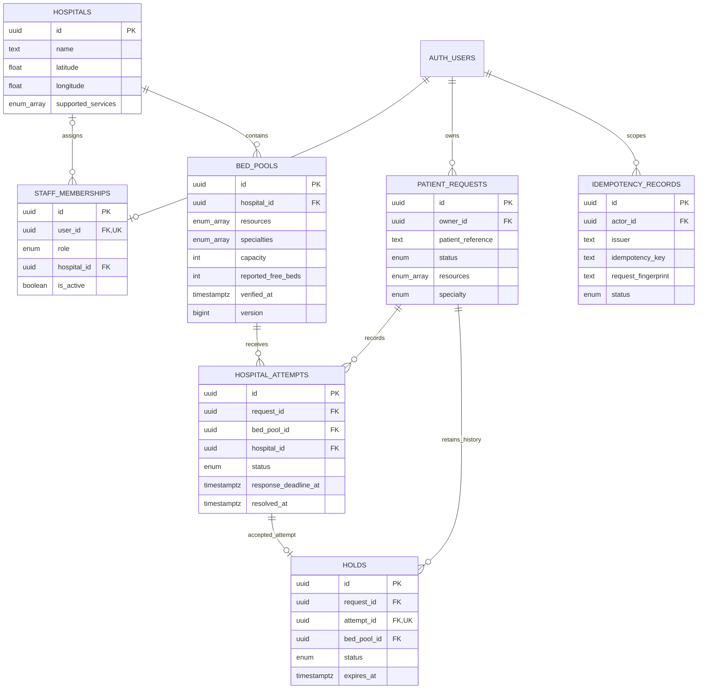

# BedLink database schema — Step 2

This schema implements storage, structural constraints and database access boundaries for the [Step 1 API contract](../api/openapi.yaml). It does **not** implement API routes, matching/ranking, census updates, acceptance, timeout settlement, arrival or cancellation workflows. Browser writes remain closed until those operations exist as audited transactions.

Apply migrations in filename order:

1. [`20261002000100_bedlink_schema.sql`](../../supabase/migrations/20261002000100_bedlink_schema.sql): types, seven tables, constraints, indexes and immediate default-deny RLS/grants.
2. [`20261002000200_bedlink_access.sql`](../../supabase/migrations/20261002000200_bedlink_access.sql): narrow read policies, authorization helpers and nurse-only patient projections.

The existing Step 1 files are unchanged. No `AGENTS.md` was present in the inspected repository or applicable local ancestors. The starting repository commit was `135d677ca2f25d16a816965f6390606c1c67c9e5`.

## Entity relationships

`auth.users` is supplied by Supabase, not created by production migrations. Every application identity/key is UUID; every stored instant is `timestamptz`. All application tables have `created_at` and `updated_at`. `updated_at` is ordinary row bookkeeping, while `verified_at` and `inventory_updated_at` have distinct operational meanings. No write or read trigger refreshes verification. Later functions must explicitly maintain update timestamps and versions.

## Tables and deliberate constraints

| Table | Meaning and enforced rules |
| --- | --- |
| `public.hospitals` | Name, validated latitude/longitude, set of supported services. Services are informational metadata, not a replacement for pool-level capabilities. |
| `public.staff_memberships` | One current membership per Auth user; role is `dispatcher` or `nurse`. A nurse must have a hospital; a dispatcher must not. `is_active=false` revokes application access without erasing history. Only trusted provisioning can change memberships. |
| `public.bed_pools` | One hospital, label, nonempty resource set and optional specialty set; positive capacity; `0 ≤ reported_free_beds ≤ capacity`; nullable verification instant; positive version bounded by JavaScript's safe integer limit. No persisted hold counter or available count. |
| `public.patient_requests` | Auth owner UUID, anonymous reference, validated location, nonempty required resource set, optional specialty, independent request status and cancellation reason. A cancelled request requires a valid reason; all other statuses require a null cancellation reason. |
| `public.hospital_attempts` | Request, hospital and selected pool; composite pool/hospital FK prevents wrong-hospital selection. Deadline equals creation plus **120 seconds**. Resolution time/reason must agree with status. One attempt per request/hospital across all history; at most one pending attempt per request. |
| `public.holds` | One hold per attempt. Composite FK requires that attempt to be **accepted** and reference the same request, pool and hospital. At most one `active` hold per request. Expiry is strictly after creation; ended time/reason agrees with status. Hold duration is not fixed in DDL because it is configurable. |
| `bedlink_private.idempotency_records` | Unique `(issuer, actor_id, idempotency_key)` across all mutation paths. Stores normalized request fingerprint, method/path, in-progress/completed status, original response body/headers/status, and completion/retention timestamps. Completed results expire exactly 24 hours after completion. No client grants or policies. |

Resources are enum values `icu`, `ventilator`, `oxygen`; specialties are `cardiac`, `burns`. Arrays are one-dimensional sets: no duplicates, null elements or nonstandard lower bounds. Hospital services are `emergency`, `critical_care`, `cardiac`, `burns`, `oxygen_support`. The immutable `array_is_set` helper checks structure only; it does not implement matching or change data.

Request statuses are `searching`, `pending`, `held`, `arrived`, `cancelled`. Attempt statuses are `pending`, `accepted`, `rejected`, `timed_out`, `cancelled`. Hold statuses are `active`, `arrived`, `cancelled`, `expired`. PostgreSQL enum validation prevents mixing them. Accepted/rejected attempt timestamps must be before the deadline; timed-out resolution equals the deadline. Arrival/cancellation of a hold must have an ended timestamp before its expiry; expired holds end at their expiry.

All historical references use `ON DELETE RESTRICT` and `ON UPDATE RESTRICT`: deleting a hospital/pool/request/accepted attempt cannot silently erase dependent history, and deleting an Auth owner/actor is blocked while requests/idempotency records reference them. The one deliberate exception is membership → Auth user, which uses `ON DELETE CASCADE` to remove the current membership when an otherwise unreferenced Auth account is deleted. Normal offboarding deactivates membership; record deletion/retention remains a later administrative design.

The internal generated `holds.accepted_attempt_status` is always `accepted`. Together with the composite attempt key, it makes the database reject a hold against a pending/rejected attempt and prevents changing an accepted attempt away from accepted while a hold references it. It must never be exposed as an API field.

## Database-to-API mapping

API IDs remain opaque strings. Serialize UUIDs as strings; do not teach the frontend to parse them. Step 1's `h_demo_cedar`, `req_success`, etc. are mock aliases, not database UUIDs. They are not imported as real primary keys.

| Database column(s) | API field / handling |
| --- | --- |
| `hospitals.id`, `.name` | `hospital.id`, `hospital.name` |
| `hospitals.latitude`, `.longitude` | `hospital.location.latitude`, `.longitude` |
| `hospitals.supported_services` | Internal catalog metadata; not added to the closed Step 1 response schema |
| `staff_memberships.user_id`, `.role`, `.hospital_id`, `.is_active` | Trusted authorization lookup only; no public staff endpoint in Step 1 |
| `bed_pools.id`, `.hospital_id`, `.label` | `bedPool.id`, `.hospitalId`, `.label` |
| `bed_pools.resources`, `.specialties`, `.capacity` | `bedPool.resources`, `.specialties`, `.capacity` |
| `bed_pools.reported_free_beds` | `bedPool.reportedFreeBeds` |
| `bed_pools.verified_at`, `.inventory_updated_at`, `.version` | `bedPool.verifiedAt`, `.inventoryUpdatedAt`, `.version` |
| `patient_requests.id`, `.owner_id`, `.patient_reference` | `request.id`, `.ownerId`, `.patientReference` |
| Request `latitude`, `longitude`, `resources`, `specialty` | `request.needs.location`, `.resources`, `.specialty` (null stays null) |
| Request `created_at`, `updated_at`, `status`, `cancellation_reason` | `createdAt`, `updatedAt`, `status`, `cancellationReason` with reason mapping below |
| Attempt `request_id`, `hospital_id`, `bed_pool_id` | `requestId`, `hospitalId`, `bedPoolId` |
| Attempt `created_at`, `response_deadline_at`, `resolved_at`, `reason_code` | `createdAt`, `responseDeadlineAt`, `resolvedAt`, `reasonCode` |
| Attempt `status = timed_out` | API `status = timedOut`; every other lifecycle status has identical spelling |
| Hold `request_id`, `attempt_id`, `hospital_id`, `bed_pool_id` | `requestId`, `attemptId`, `hospitalId`, `bedPoolId` |
| Hold `created_at`, `expires_at`, `ended_at`, `end_reason`, `status` | `createdAt`, `expiresAt`, `endedAt`, `endReason`, `status` |
| Other `created_at` / `updated_at` columns | Internal bookkeeping unless explicitly present in Step 1 schemas; never serialize database rows with `SELECT *` directly into REST responses |
| Idempotency record fields | Server-side storage only; original response body and `Location` feed replay. `Idempotency-Replayed`, `Idempotency-Expires-At` and current HTTP `Date` are response headers |

Reason value mapping is explicit: `no_longer_needed → noLongerNeeded`, `cannot_receive → cannotReceive`, `capacity_changed → capacityChanged`, `response_timeout → responseTimeout`, `request_cancelled → requestCancelled`, `ambulance_arrived → ambulanceArrived`, `transport_plan_changed → transportPlanChanged`, `hold_expired → holdExpired`. `duplicate` and `other` remain unchanged. Do not infer every enum mapping by blindly changing case.

`timestamptz` stores an instant, not a display timezone. The API serializer must emit UTC ISO 8601 with `Z`, even if the database session displays another timezone. PostgreSQL drivers may return `bigint` as text: serialize the bounded pool version as a safe JSON integer, never a JSON string.

## Inventory and freshness

The [Step 1 counting convention](../api/decisions.md#bed-pools-and-inventory) is unchanged. Each physical bed belongs to one pool, whose capability combination applies to every bed. This aggregate schema does not store a physical bed registry; hospital provisioning must guarantee the disjoint assignment. Shared equipment cannot be advertised simultaneously on more beds than it can support.

At one authoritative snapshot time T:

- F = `reported_free_beds`: physically unoccupied, staffed and usable beds, **including held beds**.
- H = count of `holds` for the pool with `status='active'` and `expires_at > T`.
- A = `F − H`: capacity available for a new hold. Required business invariant: `0 ≤ H ≤ F ≤ capacity`.
- `loadRatio = 1 − A/capacity`.
- `dataAgeMinutes = extract(epoch from (T − verified_at))/60.0`, or null when never verified. Never store this derived value.

`activeHoldCount`, `availableBeds`, `loadRatio`, `dataAgeMinutes`, `freshness`, `freshnessPolicy`, request active IDs and `activeHold` are derived/API fields, not independent writable counters. `serverTime` comes from T, not a stored resource column. Matching scores, travel estimates, diagnostics and `nextBest` belong to the later matching/API work. The demo thresholds remain 10 minutes aging and 30 minutes stale; the default hold duration remains 900 seconds. They are not hardcoded into database eligibility functions because no such workflow is implemented yet.

Before exposing authoritative REST state or mutating inventory, future operations must settle due attempts/holds and reconcile parent status in the same controlled transaction. The nurse projections filter expired rows but do **not** settle them. A partial unique index still treats a physically expired row with status `active` as active until it is updated; time is not an immutable index predicate.

| Future event | Required inventory behavior |
| --- | --- |
| Nurse update / verify | Compare expected version under lock. Verify must confirm the unchanged count. Reject F < H (`FREE_COUNT_BELOW_HOLDS`) and reject count > capacity. Refresh verification only on a successful explicit confirmation and increment version once. |
| Acceptance | Recheck fresh-enough pool and A ≥ 1 under pool/request locking; create one active hold. F unchanged, H +1, A -1; increment version/inventory timestamp, preserve verification. |
| Arrival before expiry | Mark hold/request arrived. F -1 and H -1 atomically, so A stays unchanged. Preserve verification, increment version/inventory timestamp. |
| Hold cancellation / expiry | End hold once. F unchanged, H -1, A +1. Resume searching unless cancelling the whole request. Preserve verification, increment version/inventory timestamp. |
| Read / poll | Never refresh verification or version merely because data was fetched. Lifecycle settlement may separately change inventory/version. |

A count below existing reservations must fail, without clamping the count or silently deleting holds. The dispatcher must reconcile those reservations before retry. The schema's count check enforces F within capacity; **the cross-table F ≥ H rule is deferred**, which is why ordinary client table updates are forbidden. A version column by itself does not prevent lost updates: later mutations must condition on the expected version, lock/recheck all relevant state and increment the version within the same transaction.

## Access control

Every application table has RLS enabled, including the private idempotency table. All inherited/default table privileges are explicitly revoked before narrow grants are added. There are no allow-all client policies and no client INSERT/UPDATE/DELETE policies. `anon` gets no application table or view access. An authenticated Supabase identity without an active BedLink membership gains no inventory or patient access.

| Relation / operation | Dispatcher | Assigned nurse | Trusted server / migration owner |
| --- | --- | --- | --- |
| Hospital and bed-pool reads | Configured catalog | Assigned hospital only through direct SQL/PostgREST | Privileged reads; enforce API role/scope |
| Membership reads | Own current membership only | Own current membership only | Provision/deactivate using trusted administration |
| Patient request base rows | Own requests only | None | Privileged; never return unrelated records |
| Attempt / hold reads | Own request history | Entries sent to their hospital only | Privileged |
| Nurse projections | No rows | Only current pending attempts / active unexpired holds for assigned hospital | Still caller-filtered; use correct verified actor context |
| Direct application writes | Denied | Denied, including their own pool | SQL DML available to `service_role`; future API must use atomic authorized operations |
| Idempotency records | Denied | Denied | Privileged only; private schema not exposed through REST |

Business roles and assignments come from `staff_memberships`, not user-editable JWT metadata. Current membership revocation affects reads immediately. The helper functions `is_dispatcher`, `is_nurse_for`, and `owns_request` have fixed empty `search_path`, schema-qualified references and revoked PUBLIC execute privileges. They run as trusted `postgres` to read authorization data without recursive RLS and only return booleans about `auth.uid()`.

Nurses receive minimal patient information through `hospital_incoming_attempts` and `hospital_active_holds`: anonymous reference, requirements/location and their attempt/hold identifiers/timestamps. They do not receive `owner_id`, unrelated hospital history or full base request rows. These are deliberately owner-executed, security-barrier views, **not** generic RLS-invoker views: each row explicitly checks the caller's active hospital membership. Granting nurses base request SELECT policies would expose more columns than the Step 1 inbox requires. The tests exercise both allowed projection reads and denied base/other-hospital reads.

Do not expose `bedlink_private` as a Data API schema. Its USAGE grant allows authenticated callers to execute only the approved boolean helpers used by policies; it does not grant access to idempotency tables. `service_role` and table owners can bypass RLS, so service credentials stay in trusted backend administration. No browser example includes a service-role secret. Ordinary API mutations should ultimately use narrowly granted transaction functions with verified caller identity; do not turn grants back on for direct browser PATCH/INSERT requests.

### Contract compatibility notes

1. **Nurse catalog scope:** Step 1 allows both roles to read the broad REST catalog; Step 2 asks for hospital-scoped staff inventory access. This implementation restricts nurses' **direct database** reads. The future API must mediate the broader Step 1 catalog with an explicit role-checked, catalog-only projection. If the intended product rule also forbids nurses from reading other hospitals through REST, that needs an agreed Step 1 contract change before API implementation. No existing contract was silently narrowed.
2. **UUIDs:** opaque API IDs permit UUID strings. Existing mock aliases remain mock-only; the seed uses UUIDs and maps the first three hospitals below. This is not a wire-schema change.
3. **Staging:** Step 1 describes final transactional guarantees. The new Step 2 scope explicitly excludes their full implementation; the database supplies structural constraints and blocks client writes while those transactions remain deferred.

## Indexes and remaining transactional rules

Indexes support hospital inventory, hospital membership, owner-created request listings, chronological request histories, per-hospital pending inboxes, global response deadlines, active pool/hospital holds and their expiries, actor idempotency lookups and completed-record cleanup. Composite keys support consistent FK relationships. No index predicate uses `now()`.

**The two partial unique indexes do not prevent overselling.** They enforce one pending attempt and one active hold separately for each request; they do not prevent a request having one of each, and they do not limit holds across different requests in the same pool. Later transactions must enforce:

- One live commitment across both tables, consistent parent status and immutable requirements/history.
- Pool capacity across concurrent dispatchers, F ≥ H, version comparison, one-time inventory effects and consistent timestamps.
- Current active caller role/ownership/hospital assignment on every mutation, including service-role calls and idempotent replay.
- Full same-pool capability matching, stale-data exclusion and all-attempted-hospital fallback exclusion when sending/accepting.
- Server-clock timeout/expiry checks at the effective transition instant; no acceptance or arrival backdating. Checks on stored timestamps alone cannot prove that the actual operation occurred before a deadline.
- Hold creation exactly at acceptance, configured hold duration, acceptance/hold/request atomicity, cancellation/arrival/expiry serialization and background settlement.
- Canonical request fingerprinting, conflict/replay behavior, storing the idempotency decision atomically with the business mutation, in-progress crash recovery and safe retention cleanup.

No acceptance/cancellation RPC, scheduled job, ranking function, API endpoint, UI, or deployment is included in Step 2.

## Demo seed

[`supabase/seed.sql`](../../supabase/seed.sql) creates five explicitly fictional hospitals and six disjoint pool descriptions. It only inserts missing fixed IDs (`ON CONFLICT (id) DO NOTHING`); repeat runs never overwrite an existing count, verification time, version, name, capability or location. Seed records naturally age; rerunning the seed does not make them fresh again. It creates no Auth users, memberships, patient cases, attempts or holds.

| Hospital UUID suffix | Fictional hospital | Scenario | Step 1 mock alias |
| --- | --- | --- | --- |
| `10000000-0000-4000-8000-000000000001` | Cedar Demo Hospital | ICU + ventilator + oxygen, cardiac, 2 free, initially fresh | `h_demo_cedar` |
| `…0002` | Lotus Demo Medical Centre | Same resources, cardiac/burns, 3 free, initially fresh | `h_demo_lotus` |
| `…0003` | Ember Demo Burns Centre | ICU + oxygen, burns, 2 free, initially fresh | `h_demo_ember` |
| `…0004` | Willow Demo Community Hospital | Oxygen, zero free, initially fresh | New demo hospital |
| `…0005` | Maple Demo Critical Care Centre | Critical cardiac pool with one bed left; separate oxygen pool with 35-minute-old verification | New demo hospital |

Pool UUIDs use prefix `20000000-0000-4000-8000-` and suffixes `000000000001` through `000000000006` in that order; the last two belong to Maple. Cedar/Lotus/Ember pool aliases correspond to `p_cedar_critical`, `p_lotus_critical`, `p_ember_burns`. A new local database starts with no holds, so initial offerable capacity equals its reported count, subject to freshness.

See [setup.md](setup.md) for applying and checking the schema, and [validation.md](validation.md) for the actual validation record. PostgreSQL [constraints](https://www.postgresql.org/docs/current/ddl-constraints.html), secure [function definitions](https://www.postgresql.org/docs/current/sql-createfunction.html), and Supabase's [RLS guidance](https://supabase.com/docs/guides/database/postgres/row-level-security) informed the implementation.
